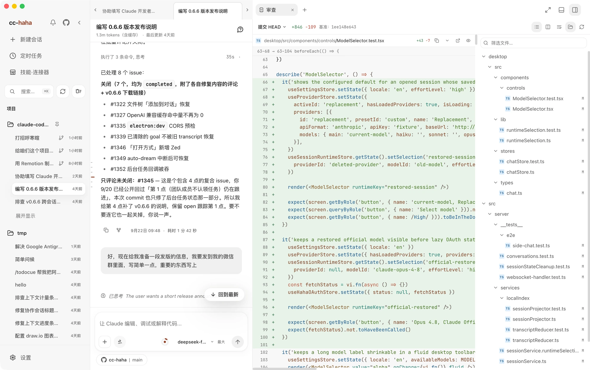
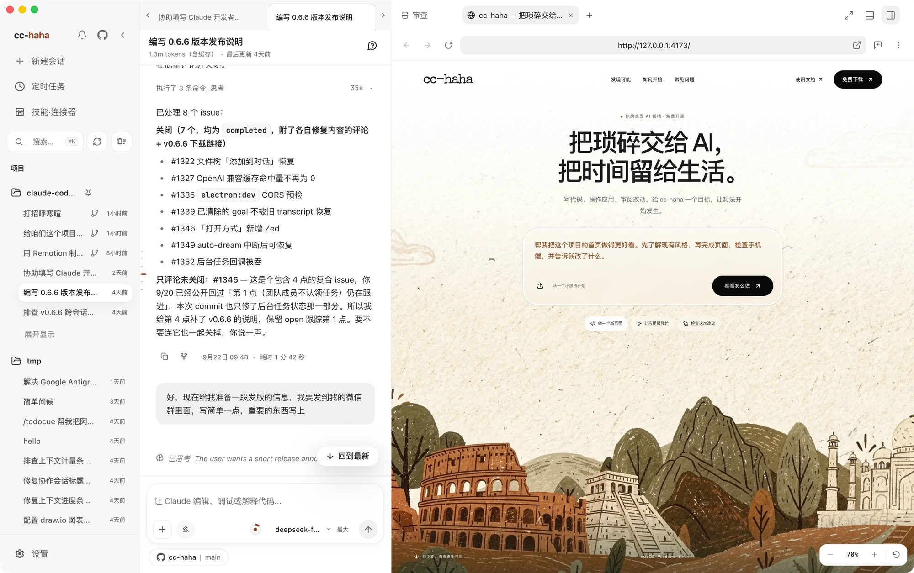

# 工作区

对话告诉你 Claude 说了什么，工作区告诉你它真的改了什么。它是右侧一块可以随时拉出来的面板，和对话并排，不用切窗口。

## 打开工作区

点标签栏右侧的「显示工作区」按钮。再点一次收起。面板左边界可以拖动改宽窄。

空面板里可以打开「侧边聊天」「审查」「终端」「浏览器」或「文件」。每种工具都有独立标签；之后也可以点顶部的 `+` 添加标签，在它们之间切换。

## 审查：选择比较范围

打开「审查」，先在工具栏的「比较范围」里选择要看的改动：

- **未暂存 / 已暂存 / 全部未提交** — 查看当前工作目录中对应范围的改动。
- **分支 / 比较分支…** — 查看与所选分支的差异。
- **查看提交…** — 输入提交引用，查看某一次提交的改动。

点「显示/隐藏文件树」可以展开所选比较范围的变更文件列表。每行显示文件状态和增删行数，点文件查看对应 Diff。本页的审查截图通过「查看提交…」打开已有的 `HEAD` 提交，是只读查看。

不是 Git 仓库时，「审查」入口会说明原因。

## 文件标签

「文件」是独立标签，用来浏览项目目录和预览单个文件。搜索框可以筛选文件名；也可以从审查里的「在文件标签页中打开」进入对应文件。打开的标签可以像编辑器一样切换。

任何文件都可以右键复制路径，或者点「添加到聊天」把它作为上下文塞回输入框。

## Diff 评审：给某一行留话

Diff 保留旧行和新行，带语法高亮。工具栏可以切换「统一 Diff / 并排 Diff」、开启自动换行；看完一个文件，还可以「标记为已查看」。需要反馈时，可以使用行级评论：

1. 点某一行，右边出现评论框。
2. 想评一段而不是一行，按住 `Shift` 点起止行——只能选同一侧、同一变更块里的连续行。
3. 写下你希望这里怎么改，点「提交」。
4. 评论会连同文件路径、行号和那几行代码一起回到输入框，直接发给 Claude。

这比在对话里描述「那个函数里判断空值那行」准确得多。

如果你在写评论的过程中 Claude 又改了这个文件，界面会提示差异已更新，需要重新选行——这是防止评论落到错误的位置。

:::tip
被拒绝的工具调用不会写盘，也就不会形成待审查的文件改动。交付前还是建议自己再过一遍 `git diff`。
:::

## 独立工作树：把试验关在笼子里

在输入框的运行位置里可以选「独立工作树」。选了以后，这条会话会拿到一个隔离的 Git worktree，Claude 的所有改动都发生在那里，你当前分支和工作目录一个字都不会动。

什么时候用它：

- 想让 Claude 大改一版，但不确定要不要留。
- 当前目录有未提交的改动，直接切分支会被 Git 拦住。
- 目标分支已经在别的工作树里检出了。

会话结束后临时工作区会被清理，历史记录仍然可以看，但那时想继续就得回原项目新建会话——界面会提示你。

## 内置浏览器

在工作区的空面板或顶部 `+` 菜单里打开「浏览器」标签，地址栏里填本地开发地址或者任意网址就能预览。它与「文件」「审查」分别保留在独立标签中。这里有三个专门为「让 Claude 看见」设计的按钮：

- **截图** — 把当前页面画面带回会话，Claude 就能看到渲染结果。
- **选择元素** — 在页面上点一个元素，它的选择器、位置和截图会一起作为上下文交给 Claude。改样式时特别省事。
- **缩放** — 调预览比例，看响应式布局。

浏览器里的登录态和 Cookie 和普通浏览器一样是真实的。做公开演示或者截图发出去之前，请换成不需要登录的页面。
