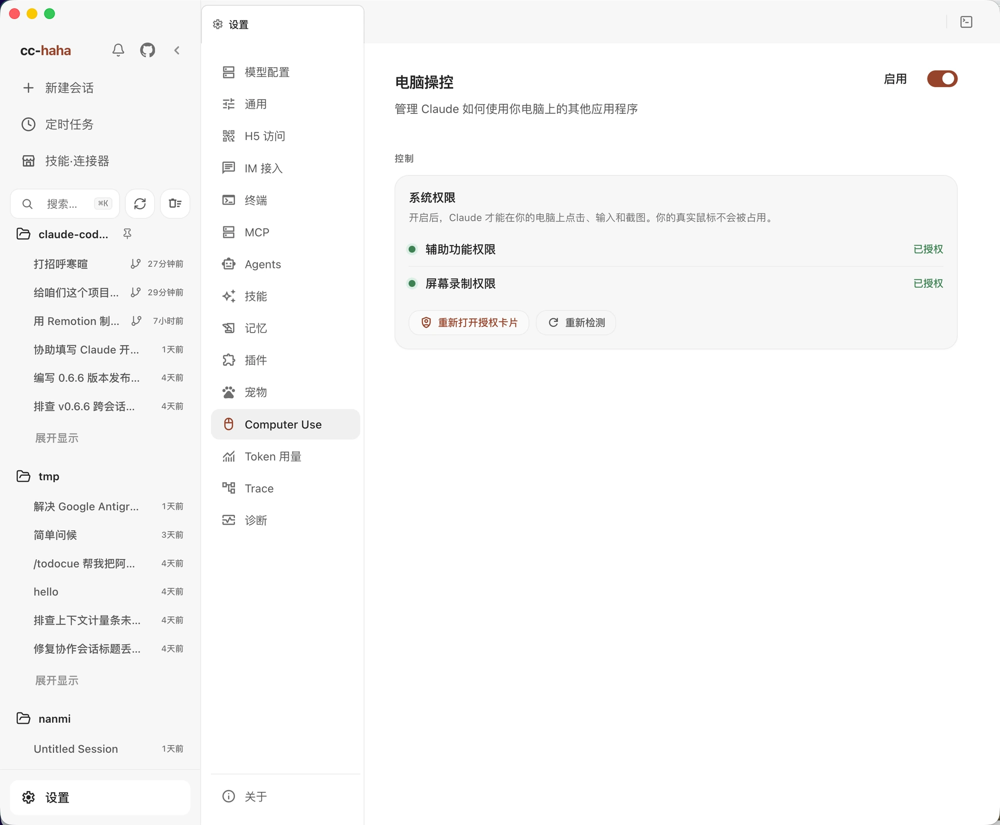

# Computer Use

With Computer Use enabled, Claude can take screenshots, click, and type in applications that have no API at all: system settings, native note apps, Finder, and third-party desktop software.

**On macOS, it does not take over your physical mouse or keyboard.** The native runtime sends actions to the target app and displays a separate virtual cursor. Your real pointer stays in place, so you can keep using your own mouse and keyboard for other work. Actions still change the target app, and some may change app focus. The Windows compatibility executor moves the real pointer, so this benefit is specific to macOS.

It acts on this computer, so read what you're authorizing before you turn it on.

macOS and Windows are supported. There is no Linux executor yet.

## Check the environment



Open **Settings → Computer Use**. On macOS 14.4 or later, the app prefers the native runtime component and shows OS permission status. Windows and other compatible runtime paths show checks for Python 3, a virtual environment, and dependencies. Follow the checks shown on your own screen; the native macOS page does not require a Python setup step.

If the page shows Python checks, install Python 3 if needed. For conda, pyenv, or another custom installation, select **Python interpreter path**, then click **Install Environment** to create the isolated venv and dependencies. Click **Re-check** when finished. If the native runtime component is missing, update or reinstall the app and check again.

## The two macOS permissions

macOS additionally requires two system permissions. Neither is optional:

| Permission | What it's for |
|---|---|
| Accessibility | Sending clicks and typing to the target app without moving the physical pointer |
| Screen Recording | Taking screenshots — i.e. letting it see |

The page has **Open accessibility settings** and **Open screen recording settings** buttons that jump straight to the right pane.

:::warning
After granting either one you must **fully quit and reopen the app**. macOS reads these permissions once at process start, so without a restart the page will keep reporting them as not granted.
:::

Make sure you're granting the permission to the app that actually launches cc-haha. Screen Recording detection is occasionally unreliable — if the system settings clearly show it granted but the page still says otherwise, it generally works anyway.

## Enable Computer Use

Turn on **Enable** and read the confirmation dialog. **Once you confirm, Computer Use may control every supported app on this computer without another approval for each app.** macOS Accessibility and Screen Recording are still granted separately by the OS. The global switch, OS permissions, and target-process checks continue to apply.

Before starting, close windows with information you do not want shown, state the task's boundaries clearly, and use the session stop button or Esc to interrupt control when needed. Turn **Enable** off here when you are finished.

## Getting started

Start a session and describe the goal and the allowed apps in plain language. Begin with something small and reversible:

```text
Take a screenshot and tell me what you see.
Open Notes and create an empty note titled "test".
Find the Displays pane in System Settings, but don't change anything.
```

Claude works in a screenshot → decide → act → screenshot loop, so it's slower than you are and will occasionally misclick. Explicit boundaries ("only inside app X", "don't save") work far better than a broad goal.

Only one session can use Computer Use at a time. If another session holds the control lock, stop or finish it first. On macOS, this does not mean your physical mouse or keyboard is occupied.

## Known limits

- **Only one session can use Computer Use at a time.** Let another session finish or stop it before trying to take control.
- **Screenshots can contain sensitive information.** Every visible window may appear in a Windows screenshot; tidy windows and the desktop on any platform before capture.
- **Observe again after the UI changes.** Old coordinates or element state may no longer be valid.
- **To stop control,** use the session stop button, Esc, or the **Enable** switch in Settings.

## Troubleshooting

**The page keeps saying permissions are missing**
Confirm you granted them to the app that actually launches cc-haha, fully quit and reopen, then click **Re-check**.

**The environment won't install**
If your page shows Python checks, choose a Python 3 installation that supports `venv` and click **Install Environment** again. If the native runtime component is missing, update or reinstall the app. For other failures, check **Settings → Diagnostics**.

**Screenshots work but clicks don't**
Check that Computer Use is still enabled, that macOS Accessibility permission is granted, and that the target app is still running. After changing OS permissions, fully quit and reopen the app, then click **Re-check**.

For global consent, the native runtime component, and compatible executors, see [Computer Use architecture](../internals/computer-use.md).
