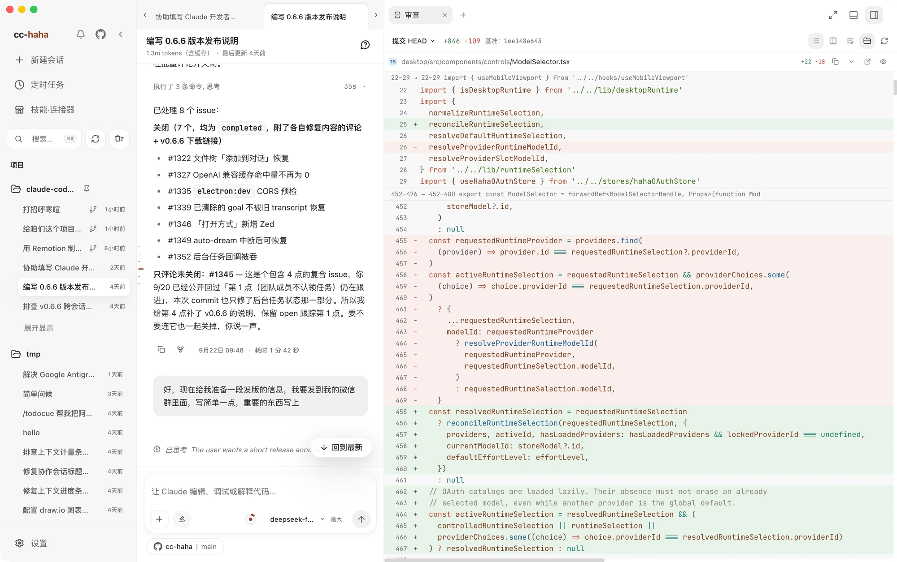

# Workspace

The conversation tells you what Claude said. The workspace tells you what it actually changed. It's a panel on the right that you can pull out next to the conversation, so you never have to switch windows.

## Opening it

Click **Show Workspace** on the right of the tab bar. Click it again to collapse. Drag the panel's left edge to resize.

The empty panel offers **Side chat**, **Review**, **Terminal**, **Browser**, and **Files**. Each opens in its own tab. Use the `+` at the top to add more tabs and switch between tools.

## Review: choose a comparison

Open **Review** and use **Comparison** in the toolbar to choose the changes you want to inspect:

- **Unstaged / Staged / All uncommitted** — the corresponding changes in the current working directory.
- **Branch / Compare branch…** — differences against the selected branch.
- **View commit…** — enter a commit reference to inspect that commit's changes.

Use **Toggle file tree** to show the files changed in the selected comparison. Each row includes a status and line counts; select a file to see its diff. The Review screenshots on this page use **View commit…** to inspect the existing `HEAD` commit in read-only mode.

If the folder is not a Git repository, the **Review** entry explains why it is unavailable.

## Files tabs

**Files** is a separate tab for browsing the project directory and previewing individual files. Use its search box to filter file names, or choose **Open file in tab** from a review. Open tabs work like editor tabs: switch between them as needed.

Any file can have its path copied, or be pushed back into the composer as context with **Add to chat**.

## Diff review: leaving a note on a line

The diff keeps old and new lines with syntax highlighting. The toolbar lets you switch between **Unified diff** and **Split diff** and enable word wrap. When you finish a file, use **Mark as viewed**. To leave feedback, use line-level comments:

1. Click a line — a comment box opens beside it.
2. To comment on a range, hold `Shift` and click the first and last line. The selection must stay on one side of the diff and inside one hunk.
3. Describe what you want changed there and click **Submit**.
4. The comment goes back into the composer along with the file path, line numbers, and the code itself, ready to send.

This is far more precise than describing "the null check in that one function" in prose.

If Claude changes the file while you're writing a comment, the panel tells you the diff has updated and asks you to reselect — that's there to stop a comment from landing on the wrong lines.

:::tip
Denied tool calls never reach disk, so they do not create file changes to review. Even so, give `git diff` one last read before you ship.
:::

## Isolated worktree: keeping experiments caged

The **Location** control in the composer offers **Isolated worktree**. Turn it on and the session gets its own Git worktree; everything Claude does happens there, and your current branch and working directory are untouched.

When it earns its keep:

- You want Claude to attempt a big rewrite you may not keep.
- Your working directory has uncommitted changes, so Git would block a branch switch.
- The branch you want is already checked out in another worktree.

The temporary worktree is cleaned up when you're done. History stays readable, but to continue you'll need a new session in the original project — the app tells you when that's the case.

## Built-in browser

Open a **Browser** tab from the empty workspace panel or the `+` menu at the top, then type a local dev address or any URL. It stays in its own tab alongside **Files** and **Review**. Three buttons here exist specifically so Claude can see what you see:

- **Capture** — send the current rendering back into the conversation.
- **Pick element** — click an element on the page; its selector, position, and a screenshot go to Claude as context. This saves an enormous amount of back-and-forth on styling.
- **Zoom** — change the preview scale to check responsive layouts.

Logins and cookies in this browser are real, same as any browser. Before you demo or screenshot anything publicly, switch to a page that doesn't require signing in.
